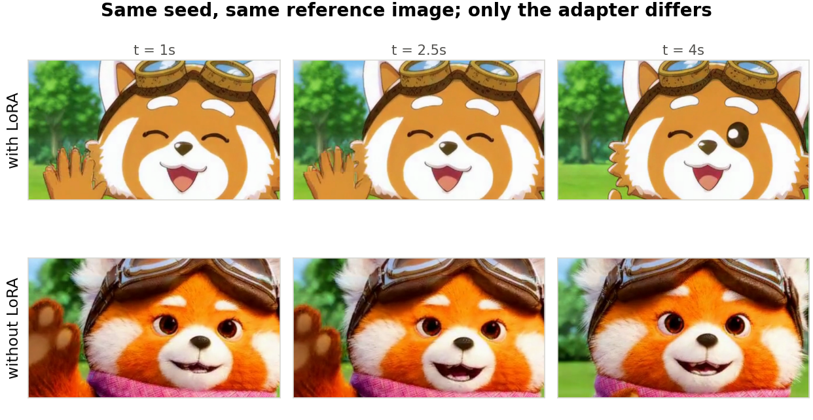

[](LICENSE)
[](paper/)
[](https://huggingface.co/masafy/minimax-h3-masafy-lora)
[](https://orcid.org/0009-0000-7977-2756)

# 🎬 MiniMax H3 キャラクタLoRA

> 33Bのオムニモーダル動画生成モデルを微調整して分かったこと — **律速はVRAMではなくシステムRAMだった**

330億パラメータの動画生成モデル **MiniMax H3** に、個人制作キャラクター「マサフィー」のLoRAを学習させた記録です。**学習時のVRAM実測ピークは3,959 MiB（搭載量の2.8%）**にすぎない一方、システムRAM 50GBの環境では3回OOMで失敗し、**188GBの環境で初めて完走**しました。学習・検証・論文執筆まで含めた総額は**約5米ドル**です。

*[English](README.en.md)*

🔗 **論文**: [日本語](paper/paper_ja.pdf) / [English](paper/paper_en.pdf) ・ 🤗 **重み**: [Hugging Face](https://huggingface.co/masafy/minimax-h3-masafy-lora)

---

## 📸 結果

同一seed・同一参照画像で、LoRAの有無だけを変えた比較です。



参照画像はキャラクターの**構造**を与えますが、**画風**は与えません。上段（LoRAあり）は平坦な塗りのイラスト、下段（なし）は毛並みまで描かれた写実的な描画になります。

## ✨ 分かったこと

- **律速はシステムRAM** — VRAMは48GBの環境で失敗も成功も起きており成否を予測しない。システムRAMは50GBと188GBの間に明確な閾値を持つ
- **必要VRAMは4GB弱** — 学習時の実測ピーク3,959 MiB。VRAM 12GBのRTX 3060でもVRAMだけなら足りていた
- **RAM割当は価格と無相関** — RTX 4090（$0.69/h）はRAM 41GBで、より安いRTX 3090（$0.50/h）の125GBより少ない。**GPUの格でRAMを推定してはいけない**
- **量子化を跨いで移植できる** — 枝刈りINT8で学習したLoRAが、GGUF Q3_K_Mの推論環境に**208モジュール全一致**で適用できた（キー不一致0件）
- **推論は手元で完結** — VRAM 9.3GB。学習だけ借りて運用は自宅、という構成が成立する
- **LoRAが担うのは画風** — 参照画像方式では構造的安定性は参照画像が担保する。LoRAの投資対効果は「自分の絵柄で出せること」にある
- **800ステップは過剰だった** — 交差検証の結果、推奨は**500ステップ・強度0.8**。学習時間は約2時間から約1.25時間へ短縮できる
- **黙ってCPUで走る罠** — pipが既定で入れるtorchはCUDA 13向けで、ドライバが12.8だと`cuda.is_available()`が偽のまま「進捗を報告しながら」CPUで動き続ける

## 🛠️ 技術スタック

| カテゴリ | 技術 |
|---|---|
| ベースモデル | MiniMax H3 Ref2VA（枝刈りINT8 ConvRot, 20.0GB） |
| テキストエンコーダ | Qwen3-VL 32B（nvfp4 AWQ, 15.7GB） |
| 学習 | [ai-toolkit](https://github.com/ostris/ai-toolkit) @ `f4e9130` |
| 推論 | ComfyUI + ComfyUI-GGUF（Q3_K_M） |
| 学習環境 | RunPod RTX 6000 Ada（VRAM 48GB / RAM 188GB / $0.84h） |
| 推論環境 | RTX 3060 12GB（ローカル） |
| 組版 | LuaLaTeX + luatexja（2カラム） |

## 📁 ディレクトリ構成

```
.
├── paper/                  技術報告（日英）
│   ├── paper_ja.tex/.pdf     日本語版・7ページ
│   ├── paper_en.tex/.pdf     英語版・7ページ
│   └── figures/              図7点
├── dataset/                学習データ（公開）
│   ├── train/                12枚＋キャプション
│   ├── validation/           2枚（検証用・未学習）
│   └── excluded/             2枚（外見差が大きく除外）
├── logs/                   実測データ
│   ├── training_loss.csv     損失799点
│   ├── env_matrix.csv        環境別のVRAM/RAM/成否
│   ├── ram_allocation.csv    公表値と実測値の対比
│   ├── timings.csv           工程別の所要秒数
│   └── cost.csv              費用の内訳（見積りと実測を区別）
├── scripts/
│   ├── runpod-automation/    無人実行セット（後述）
│   └── ...                   学習・監視スクリプト
├── config/                 学習設定（smoke / coexist / full）
└── lora/README.md          重みの入手先と推奨設定
```

## 🚀 使い方

### 推論（ComfyUI）

```bash
# 1. 重みを Hugging Face から取得して models/loras/ へ置く
# 2. UnetLoaderGGUF の後ろに LoraLoaderModelOnly を挟む
# 3. model を受け取る全ノードを差し替える（下記の注意を参照）
```

```
UnetLoaderGGUF → LoraLoaderModelOnly → BasicGuider
                                     → BasicScheduler
```

**`BasicGuider` と `BasicScheduler` の両方**を差し替えること。片方だけだと、guiderとschedulerが別のモデルを見て静かに事故ります。

プロンプトは `masafy_character,` で始め、続けて外見（茶色の飛行帽ゴーグル、ピンクの模様スカーフ）を記述します。**トリガー語だけでは不十分**です（論文8.4節）。

### 学習の再現

```bash
# RAMが足りる環境を選ぶ（VRAMではなくRAMで選ぶ）
python3 scripts/runpod-automation/sample_ram.py

# Pod作成後、転送してチェーンを起動
RUNPOD_SSH_HOST=... RUNPOD_SSH_PORT=... RUNPOD_SSH_KEY=... bash scripts/upload_to_runpod.sh
ssh pod "apt-get install -y rsync"           # Podにrsyncは入っていない
ssh pod "setsid nohup bash /workspace/chain_full.sh &"

# 番人をローカル側で起動（完了検知→回収→terminate）
setsid nohup bash scripts/runpod-automation/guardian.sh <POD_ID> <IP> <PORT> &
```

## 🤖 無人実行セット

`scripts/runpod-automation/` に、時間課金の環境で「投げたら朝には終わって課金も止まっている」状態を作るための3本を置いています。実際にこの構成で本学習が人の介在ゼロで完走しました。

| ファイル | 役割 |
|---|---|
| `chain_full.sh` | Pod側。DL→構築→CUDA修正→**検証**→学習を待ち時間なしで連結 |
| `guardian.sh` | 監視側。完了/24時間/残高$3で回収→terminate |
| `sample_ram.py` | GPU種別のRAM実測（作って読んで即消す） |

設計上の要点は3つで、いずれも実際に踏んだ失敗から来ています。

- **番人はPodの外に置く** — 中に置くとterminateで自分ごと消えて回収が終わらない
- **完了判定はファイルの有無** — `pgrep -f xxx.sh` はSSH越しだと自分のコマンド文字列にマッチして常に真になる
- **stopでは課金が止まらない** — 停止中はストレージ単価が倍になる。**terminateまで**やる

詳細は [scripts/runpod-automation/README.md](scripts/runpod-automation/README.md) を参照してください。

## 📄 シリーズ

消費者向けGPUでのキャラクタLoRA微調整を追った一連の報告の3作目です。

| | モデル | 規模 | 結果 |
|---|---|---|---|
| 1 | Stable Diffusion 1.5 | 1B | RTX 3060で成立 |
| 2 | [Krea 2](https://github.com/masafykun/krea2-character-lora) | 12B | FP8＋ブロックスワップで成立 |
| **3** | **MiniMax H3（本リポジトリ）** | **33B＋TE 32B** | **成立せず。ただし原因はVRAMではなくRAM** |

## 📚 引用

```bibtex
@techreport{suzuki2026h3lora,
  author = {Suzuki, Masato},
  title  = {Character LoRA Fine-tuning of a 33B Omni-modal Video Model:
            System RAM, Not VRAM, Was the Binding Constraint},
  year   = {2026},
  url    = {https://github.com/masafykun/minimax-h3-masafy-lora}
}
```

## 🎨 キャラクターについて

`dataset/` のキャラクター「マサフィー」は著者が制作したオリジナルキャラクターです。実験の再現のために画像とキャプションを公開していますが、**キャラクターデザインそのものは著者の著作物**です。利用の際はクレジットを記載してください。

## ライセンス

- **コード**（`scripts/`）: **MIT** — [LICENSE](LICENSE) を参照
- **論文・図・実測データ**（`paper/`, `logs/`）: **CC BY 4.0**
- **モデル重み**: ベースモデルのライセンスに従う — [NOTICE.md](NOTICE.md) を参照。商用利用時は **"MiniMax H3" の表示が必要**
- **キャラクター画像**（`dataset/`）: 上記「キャラクターについて」を参照

© 2026 masafykun (https://github.com/masafykun)
