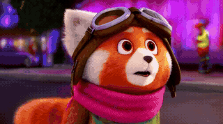

# 検証クリップ / Verification clips

論文のアブレーションの根拠となる24本です。各GIFはブラウザ上でそのまま再生されます
（元のmp4も同じディレクトリにあります）。

The 24 clips behind the ablations in the paper. The GIFs play inline; the source
mp4 files sit alongside them.

**共通条件 / Fixed across every clip:** seed `20260812` ・
参照画像 [`masafy_004.png`](../dataset/validation/masafy_004.png)（学習に未使用 / held out）・
同一プロンプト ・ 864x480 ・ 20 steps。
`ref016` と `seed2` のみ、それぞれ参照画像とseedを変更しています。

> **出力サイズは画風の移行度の指標であって、品質の指標ではありません。**
> 学習データが平坦な塗りのため、画風が寄るほど圧縮が効きます。ここで最小の
> `str12` と `ckpt700` は、いずれも破綻や違和感を含んでいます。
>
> *Output size proxies style displacement, not quality. The smallest files here
> are the ones carrying artifacts.*

## 基準 / Baseline

| | 条件 / Condition | 元動画 |
|---|---|---|
|  | アダプタ無し / no adapter | [`OFF.mp4`](OFF.mp4) |
|  | 最終版・強度1.0 / final, strength 1.0 | [`ON.mp4`](ON.mp4) |

## 適用強度 / Adapter strength (checkpoint 800)

| | 条件 / Condition | 元動画 |
|---|---|---|
|  | 0.2 | [`str02.mp4`](str02.mp4) |
|  | 0.4 | [`str04.mp4`](str04.mp4) |
|  | 0.6 | [`str06.mp4`](str06.mp4) |
|  | 0.8 | [`str08.mp4`](str08.mp4) |
|  | 1.2 — 過剰 / over-applied | [`str12.mp4`](str12.mp4) |

## 学習段階 / Checkpoint (strength 1.0)

| | 条件 / Condition | 元動画 |
|---|---|---|
|  | 300 | [`ckpt300.mp4`](ckpt300.mp4) |
|  | 400 | [`ckpt400.mp4`](ckpt400.mp4) |
|  | 500 | [`ckpt500.mp4`](ckpt500.mp4) |
|  | 600 | [`ckpt600.mp4`](ckpt600.mp4) |
|  | 700 | [`ckpt700.mp4`](ckpt700.mp4) |

## 交差検証 / Cross-validation

| | 条件 / Condition | 元動画 |
|---|---|---|
|  | step 400 × 0.6 | [`x_c400_s06.mp4`](x_c400_s06.mp4) |
|  | step 500 × 0.6 | [`x_c500_s06.mp4`](x_c500_s06.mp4) |
|  | step 500 × 0.8 — **推奨 / recommended** | [`x_c500_s08.mp4`](x_c500_s08.mp4) |
|  | step 500 × 1.2 | [`x_c500_s12.mp4`](x_c500_s12.mp4) |

## トリガー語 / Trigger token

| | 条件 / Condition | 元動画 |
|---|---|---|
|  | トリガー語なし / trigger removed | [`notrig_on.mp4`](notrig_on.mp4) |
|  | トリガー語のみ / trigger only — 失敗 / fails | [`onlytrig.mp4`](onlytrig.mp4) |

## 未学習の場面 / Unseen scenes

| | 条件 / Condition | 元動画 |
|---|---|---|
|  | 夜の街・アダプタ有 / night, with | [`night_on.mp4`](night_on.mp4) |
|  | 夜の街・アダプタ無 / night, without | [`night_off.mp4`](night_off.mp4) |
|  | 自転車・アダプタ有 / bicycle, with | [`bike_on.mp4`](bike_on.mp4) |
|  | 自転車・アダプタ無 / bicycle, without | [`bike_off.mp4`](bike_off.mp4) |

## 頑健性 / Robustness

| | 条件 / Condition | 元動画 |
|---|---|---|
|  | 別の未学習参照画像 / different held-out reference | [`ref016.mp4`](ref016.mp4) |
|  | 別のseed / different seed | [`seed2.mp4`](seed2.mp4) |

---

24本。分析は [`../paper/`](../paper/) を参照。
